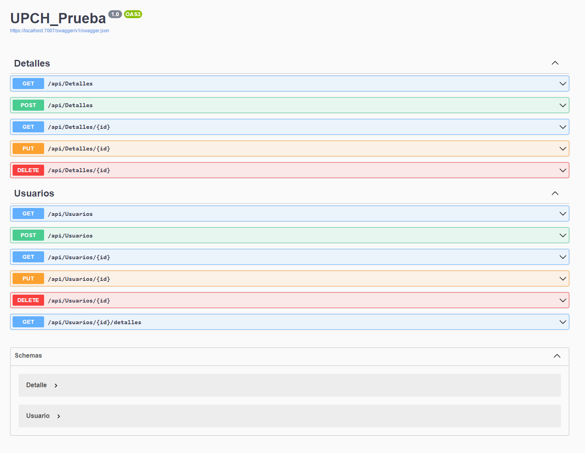
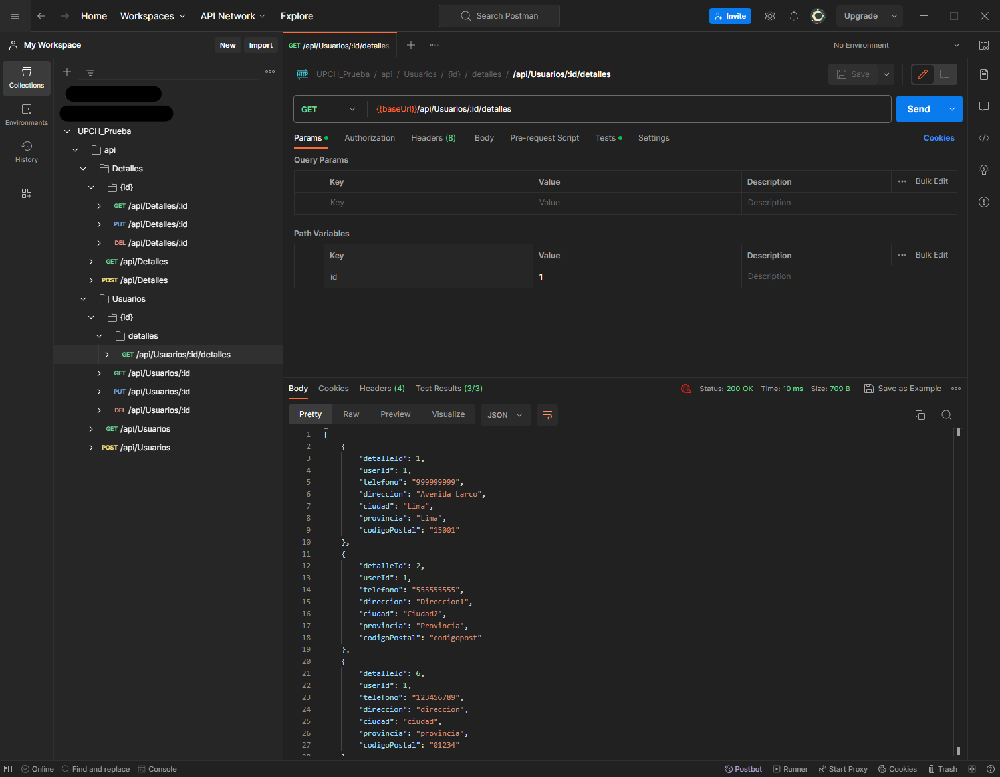
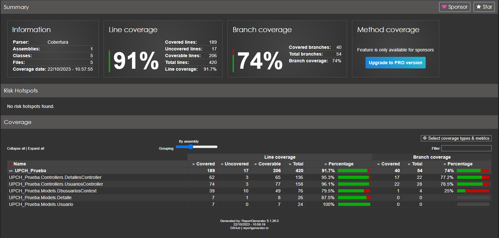

# Reto UPCH
> Crud simple de dos tablas.

## Table of Contents
* [General Info](#general-information)
* [Technologies Used](#technologies-used)
* [Features](#features)
* [Screenshots](#screenshots)
* [Setup](#setup)
* [Usage](#usage)
* [Room for Improvement](#room-for-improvement)
* [Contact](#contact)

## General Information
Requerimientos Técnicos:

1. Codigo de Apis
2. Script de la base de datos (Sql Server, Postgresql o Oracle)
3. Postman Collection

## Technologies Used
- ASP.NET Core
- .NET 7.0 (v7.0.401)
- Microsoft SQL Server 2019 - 15.0.4153.1 (X64)
- xUnit

## Features
- Crud de tablas Usuarios y Detalles.

## Screenshots
- Swagger del Api

- Collection del Postman

- Code coverage

## Setup

- Ejecutar los scripts 'DB - TABLAS.sql' y 'DATOS.sql'.

- Corregir 'ConnectionString' dentro de 'appsettings.json' de ser necesario.

- Restaurar paquetes nugget de ser necesario. `dotnet restore` o por el wizard.

## Usage
- Para levantar el proyecto. `dotnet run --launch-profile https` o por el debugger.

## Room for Improvement
Room for improvement:
- Dockerizar

## Contact
Creado por Angelo Riega.

angelo.riega.iriarte@gmail.com
